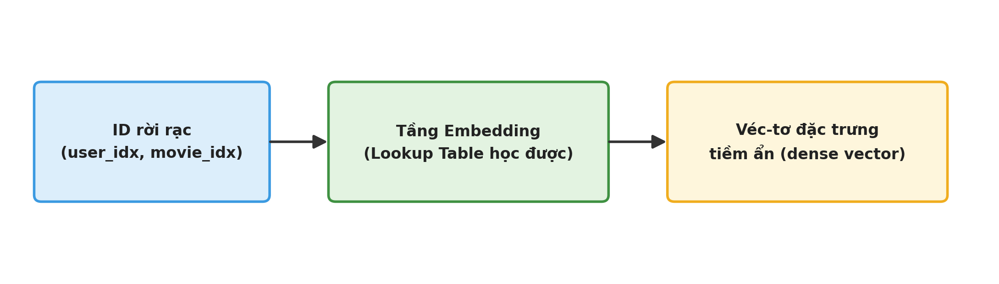
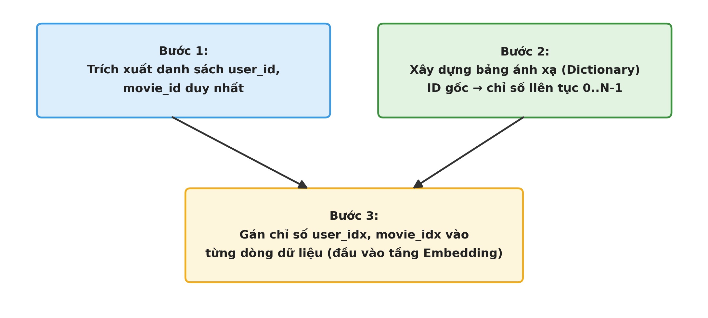
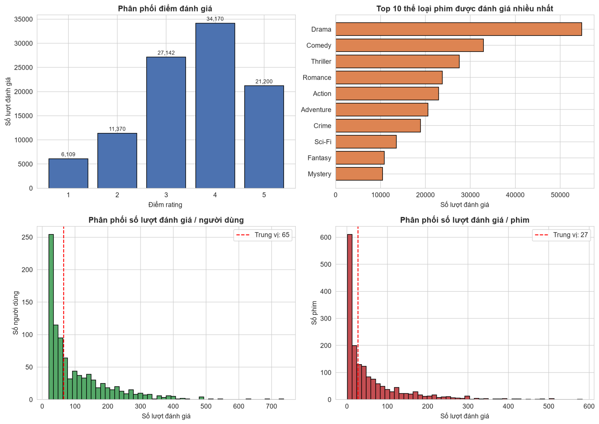
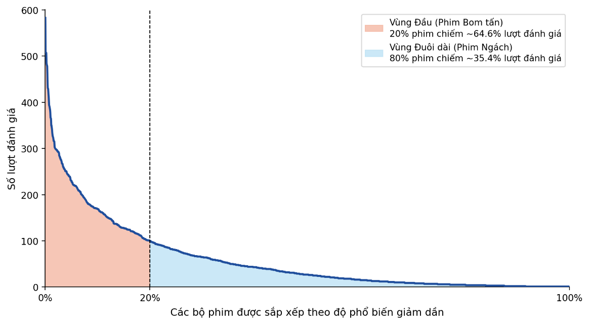
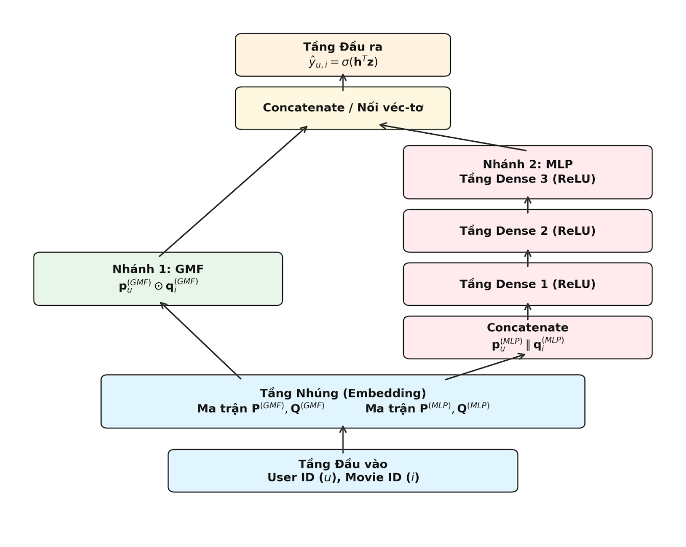
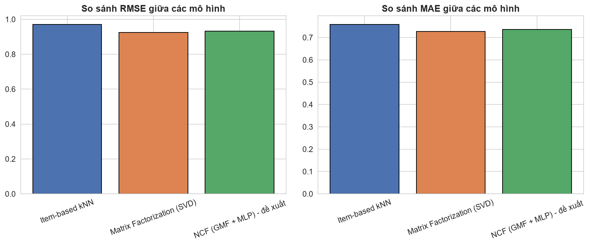
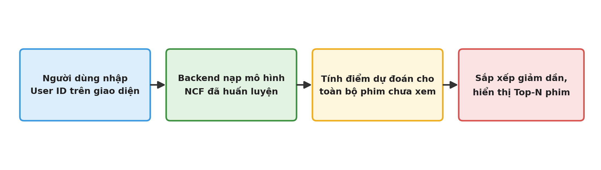

## 1. Overview

**“Movie Recommendation Application Development for Personalized User Experience Using Deep Learning”** is a Data Science project that develops a personalized movie recommendation system from user rating behavior.

The project follows an **experimental research + software development** approach, covering data collection and preprocessing, exploratory data analysis (EDA), baseline recommender models, Neural Collaborative Filtering (NCF), quantitative evaluation, and a Streamlit-based Web Proof of Concept.

The project focuses not only on rating prediction accuracy but also on bridging the gap between an academic model and an interactive application.

## 2. Problem and Motivation

Online entertainment platforms expose users to a very large amount of content, creating an information overload problem when searching for suitable movies.

Traditional recommendation methods such as Item-based kNN and Matrix Factorization have limitations:

- High sparsity in the User–Item matrix.
- High computational cost for neighborhood-based methods at scale.
- Limited linear representation in traditional Matrix Factorization.
- A gap between notebook-based experimentation and real-world deployment.

The project therefore explores **Neural Collaborative Filtering (NCF)** to learn latent representations and model nonlinear User–Item interactions.

## 3. Objectives

- Analyze and clean MovieLens 100K.
- Construct the User–Item matrix and analyze sparsity.
- Build **Item-based kNN** and **Matrix Factorization** baselines.
- Develop an **NCF architecture combining GMF and MLP**.
- Optimize the model with Adam and Early Stopping.
- Compare models using RMSE, MAE, and training time.
- Integrate the trained NCF model into a Streamlit Web Proof of Concept.

## 4. Dataset

The project uses the **MovieLens 100K** dataset.

After joining and preprocessing:

| Metric | Value |
|---|---:|
| Original ratings | 100,000 |
| Ratings after join | 99,991 |
| Users | 943 |
| Movies | 1,681 |
| Mean rating | 3.530 |
| User–Item sparsity | 93.692% |
| Avg. ratings / user | 106.0 |
| Avg. ratings / movie | 59.5 |

Main data files:

- `u.data`: 100,000 ratings containing `user_id`, `movie_id`, `rating`, and `timestamp`.
- `movielens_100k.csv`: extended movie metadata including title, year, directors, actors, and genres.

## 5. Workflow



```text
Data collection
      ↓
Data cleaning & preprocessing
      ↓
EDA
      ↓
User / Movie ID encoding
      ↓
Train / Validation / Test split
      ↓
Baseline: Item-based kNN + Matrix Factorization
      ↓
Neural Collaborative Filtering (GMF + MLP)
      ↓
RMSE / MAE evaluation
      ↓
Streamlit Web PoC
```

## 6. Data Preprocessing

Main steps:

1. Load ratings and movie metadata.
2. Join datasets using `movie_id`.
3. Convert `timestamp` to datetime.
4. Handle missing movie metadata.
5. Check duplicate User–Movie pairs.
6. Prepare genre information for EDA.
7. Encode User IDs and Movie IDs into continuous indices for Embedding.
8. Calculate User–Item matrix sparsity.
9. Save the cleaned dataset as `movielens_cleaned.csv`.

Nine ratings were removed during the join because the corresponding `movie_id` was missing from the metadata. Missing values in `directors`, `actors`, and `genres` were filled with `"Unknown"`.



## 7. Exploratory Data Analysis

EDA covers:

- Rating distribution.
- Top 10 most-rated genres.
- Number of ratings per user.
- Number of ratings per movie.
- Long-tail distribution analysis.

Rating 4 received the largest number of ratings with **34,170 ratings**, around **34.2%** of all ratings. Drama and Comedy were the most frequently rated genres.



### Long-tail distribution

The dataset exhibits a clear long-tail pattern: a small group of popular movies receives a large share of interactions, while many movies receive relatively few ratings.



## 8. Embedding-based Representation Learning

NCF uses **Representation Learning** instead of relying only on manually engineered features.

User IDs and Movie IDs are mapped through Embedding layers to learn latent feature vectors. The experiment uses **8-dimensional embeddings for both GMF and MLP branches**, which is appropriate for the moderate dataset size and helps reduce overfitting.



## 9. Models

### 9.1 Item-based kNN

Computes **Cosine Similarity** between movies based on their rating vectors.

- `K = 20`

### 9.2 Matrix Factorization

Uses a **Biased Matrix Factorization** model:

- Latent factors: `K = 20`
- Epochs: `25`
- Learning rate: `0.01`
- Regularization: `0.05`
- Optimizer: SGD

### 9.3 Neural Collaborative Filtering (NCF)

The proposed model combines:

- **GMF (Generalized Matrix Factorization)** for linear interactions.
- **MLP (Multi-Layer Perceptron)** for higher-order nonlinear interactions.

### Main hyperparameters

| Parameter | Value |
|---|---:|
| GMF embedding | 8 |
| MLP embedding | 8 |
| Hidden layers | 16 → 8 |
| Batch size | 256 |
| Learning rate | 0.001 |
| L2 regularization | 1e-4 |
| Early Stopping patience | 5 |
| Maximum epochs | 40 |

The NCF training process stopped early at **epoch 11** after validation performance stopped improving.

## 10. Data Split

From 99,991 cleaned ratings:

- **Test:** 20% = 19,999
- **Train:** 80% = 79,992
- The Train split was further divided into:
  - **Training:** 71,992
  - **Validation:** 8,000

The Test set remained completely independent for the final evaluation.


## 11. Model Evaluation

Because the task is **rating prediction (regression)**, the project uses:

- **RMSE (Root Mean Squared Error)**
- **MAE (Mean Absolute Error)**

### Test-set results

| Model | RMSE | MAE | Training Time |
|---|---:|---:|---:|
| Item-based kNN | 0.9712 | 0.7589 | 0.8 s |
| Matrix Factorization (SVD) | **0.9208** | **0.7251** | 28.8 s |
| NCF (GMF + MLP) | 0.9313 | 0.7353 | **3.9 s** |



### Findings

- **Matrix Factorization** achieved the best RMSE and MAE in the reported experiment.
- **NCF** clearly outperformed Item-based kNN in both error metrics.
- NCF trained substantially faster than Matrix Factorization.
- NCF did not outperform Matrix Factorization in pure prediction accuracy on MovieLens 100K, which is consistent with the moderate dataset size and relatively small embedding dimension.
- NCF was still selected for deployment because of its competitive accuracy and better potential for integrating additional features.

## 12. Web Proof of Concept

The thesis also develops a **Streamlit Web Proof of Concept** to demonstrate practical deployment of the NCF model.

Main interaction areas include:

- User ID input / selection.
- Top-N recommendation control.
- Recommended movie cards.
- Movie title, year, genre, and predicted score.
- Basic statistics from the selected user's rating history.

The trained model is loaded into memory when the server starts, avoiding model reloading for every user interaction.



> **Note:** The current repository emphasizes the data, modeling, and experimental components. If the Streamlit application source is added later, an `app/` directory and corresponding run instructions can be included.

## 13. Repository Structure

```text
movie-recommendation-deep-learning/
├── code/
│   └── movie_recommendation.ipynb
├── data/
│   ├── u.data
│   ├── movielens_100k.csv
│   └── movielens_cleaned.csv
├── images/
│   ├── eda_overview.png
│   ├── model_comparison_chart.png
│   ├── ncf_architecture.png
│   ├── embedding_pipeline.png
│   ├── id_encoding_pipeline.png
│   ├── long_tail_distribution.png
│   ├── dataset_split.png
│   └── web_integration_flow.png
├── .gitignore
├── requirements.txt
└── README.md
```

## 14. Technologies

- Python
- Pandas
- NumPy
- Matplotlib
- Seaborn
- Scikit-learn
- Jupyter Notebook
- Neural Collaborative Filtering
- GMF
- MLP
- Adam
- Streamlit

## 15. Installation

```bash
git clone https://github.com/thang19814/movie-recommendation-deep-learning.git
cd movie-recommendation-deep-learning
```

Create a virtual environment:

```bash
python -m venv .venv
```

Activate it on Windows:

```bash
.venv\Scripts\activate
```

Install dependencies:

```bash
pip install -r requirements.txt
```

## 16. Run the Notebook

```bash
jupyter notebook code/movie_recommendation.ipynb
```

**Note:** the notebook uses relative dataset paths. When running it in another environment, make sure the working directory is configured correctly or update the paths.

## 17. Limitations

According to the thesis:

- MovieLens 100K is much smaller than real-world commercial recommendation datasets.
- Comprehensive hyperparameter optimization using Grid Search or Bayesian Optimization was not performed.
- Top-N ranking metrics such as Precision@K, Recall@K, and NDCG@K were not evaluated.
- Cold-start for new users and new movies is not fully addressed.
- The Web application remains a Proof of Concept and does not yet include production features such as authentication, real-time feedback storage, or large-scale deployment.

## 18. Future Work

- Scale experiments to MovieLens 1M, 10M, or 25M.
- Perform automated hyperparameter optimization.
- Add Precision@K, Recall@K, and NDCG@K.
- Incorporate content features such as genre, director, and actor into a Hybrid Recommender.
- Improve cold-start handling.
- Upgrade the Web application toward production deployment.
- Explore advanced architectures such as AutoRec, CDAE, and Graph Neural Networks.

## 19. Academic Information

- **University:** Nguyen Tat Thanh University
- **Faculty:** Faculty of Information Technology
- **Major:** Data Science
- **Student:** Dinh Xuan Thang
- **Cohort:** 2023
- **Supervisor:** M.Sc. Pham Dinh Tai
- **Project period:** 01/03/2026 – 30/04/2026

---

## Academic report reference

This repository is based on the major project:

**“Phát triển ứng dụng gợi ý phim nhằm cá nhân hóa trải nghiệm người dùng sử dụng công nghệ Học sâu”**

---

# License / Usage

This repository is intended for academic and portfolio purposes. Please refer to the original dataset terms before redistributing the MovieLens data.
