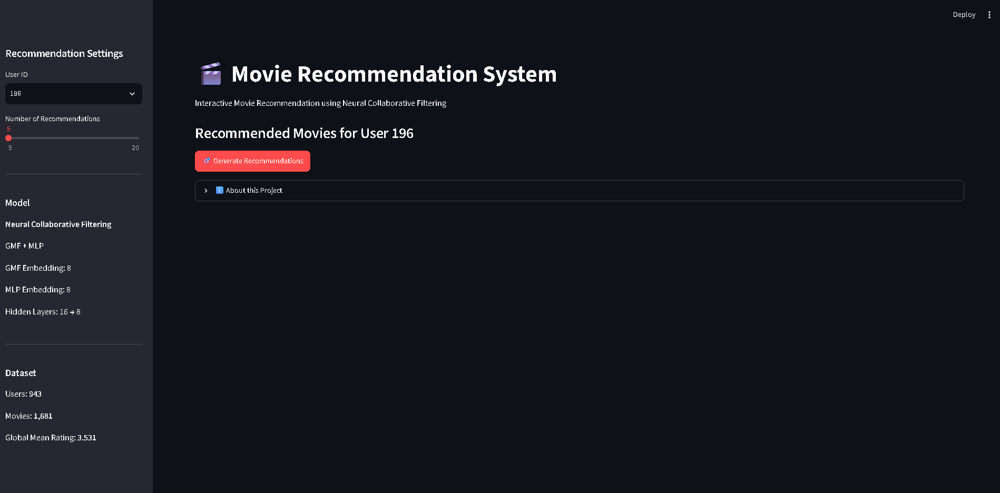
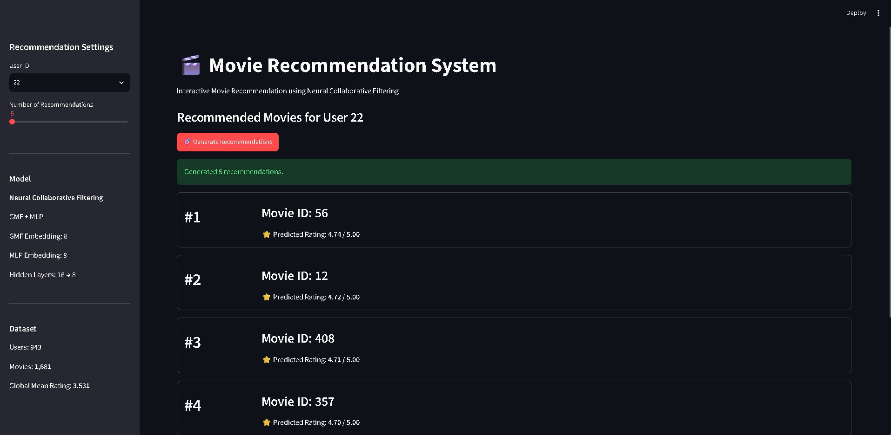

# 🎬 Movie Recommendation System using Deep Learning

A personalized **Movie Recommendation System** built with **Neural Collaborative Filtering (NCF)** and a custom NumPy implementation. The project uses the **MovieLens 100K dataset**, compares several recommendation approaches, and provides an interactive **Streamlit Web PoC**.

## 📌 Project Overview

```text
MovieLens 100K
      ↓
Data Collection
      ↓
Data Preprocessing
      ↓
Exploratory Data Analysis (EDA)
      ↓
Recommendation Models
      ├── Item-based kNN
      ├── Matrix Factorization
      └── Neural Collaborative Filtering (NCF)
                ↓
        GMF + MLP Architecture
                ↓
        Model Evaluation
                ↓
        Model Export
                ↓
       Streamlit Web PoC
                ↓
       Top-N Recommendations
```

## ✨ Features

- Data preprocessing and cleaning
- Exploratory Data Analysis (EDA)
- User/movie ID encoding
- User–item matrix sparsity analysis
- Item-based kNN recommendation
- Matrix Factorization
- Neural Collaborative Filtering (NCF)
- GMF + MLP architecture
- Adam optimization
- Early Stopping
- RMSE and MAE evaluation
- Export of trained NCF parameters
- Interactive Streamlit Web PoC
- Top-N personalized recommendations
- Filtering of movies already rated by the selected user

## 🧠 Neural Collaborative Filtering

The main recommendation model is a custom NumPy implementation of NCF.

```text
User ID ──→ User Embedding ──→ GMF ──┐
                                     ├──→ Concatenate ──→ Output
Movie ID ─→ Movie Embedding ─→ GMF ──┤
                                     │
User ID ──→ User Embedding ──→ MLP ──┤
Movie ID ─→ Movie Embedding ─→ MLP ──┘
```

| Component | Configuration |
|---|---|
| GMF embedding | 8 |
| MLP embedding | 8 |
| MLP hidden layers | 16 → 8 |
| Optimizer | Adam |
| Training control | Early Stopping |

The NCF model is implemented directly with NumPy rather than a high-level deep learning framework.

## 📊 Dataset

The project uses the **MovieLens 100K** dataset.

After preprocessing and joining rating data with movie metadata:

- **Users:** 943
- **Movies:** 1,681
- **Ratings after join:** 99,991
- **User–Item matrix sparsity:** 93.6921%

Movie metadata includes title, year, directors, actors, and genres. The processed data also contains user/movie indices used by the recommendation models.

## 📈 Model Evaluation

| Model | RMSE | MAE |
|---|---:|---:|
| Item-based kNN | 0.971243 | 0.758880 |
| Matrix Factorization | 0.924668 | 0.727684 |
| Neural Collaborative Filtering | **0.931588** | **0.735622** |

> Lower RMSE and MAE indicate better prediction performance.

The comparison helps evaluate traditional collaborative filtering methods against the NCF approach used for the interactive application.

## 🌐 Streamlit Web PoC

The trained NCF model is exported and used for inference in a Streamlit application.

The Web PoC allows users to:

1. Select a User ID.
2. Select the number of recommendations.
3. Generate personalized Top-N recommendations.
4. View predicted ratings.
5. Exclude movies already rated by the selected user.

### Recommendation workflow

```text
User ID
   ↓
Load trained NCF parameters
   ↓
Generate predictions for candidate movies
   ↓
Remove already-rated movies
   ↓
Sort by predicted rating
   ↓
Return Top-N recommendations
```

### Screenshots

> Update the filenames below if your actual screenshots in `images/` use different names.





## 📁 Project Structure

```text
movie-recommendation-deep-learning/
│
├── app/
│   └── app.py
│
├── code/
│   └── movie_recommendation_streamlit.ipynb
│
├── data/
│   ├── u.data
│   └── movielens_100k.csv
│
├── models/
│   └── ncf_params.npz
│
├── images/
│   ├── streamlit_home.png
│   └── recommendation_result.png
│
├── requirements.txt
├── .gitignore
└── README.md
```

> Raw datasets and generated model binaries can be excluded from GitHub when appropriate. See `.gitignore`.

## ⚙️ Installation

Clone the repository:

```bash
git clone https://github.com/thang19814/movie-recommendation-deep-learning.git
cd movie-recommendation-deep-learning
```

Create and activate a virtual environment:

### Windows

```powershell
python -m venv .venv
.venv\Scripts\activate
```

Install dependencies:

```bash
pip install -r requirements.txt
```

## 🚀 Run the Streamlit Web PoC

Make sure the trained model is available at:

```text
models/ncf_params.npz
```

Then run:

```bash
python -m streamlit run app/app.py
```

The application will be available at:

```text
http://localhost:8501
```

## 🧪 Reproduce the Model

1. Open `code/movie_recommendation_streamlit.ipynb`.
2. Run the notebook from data collection through training and evaluation.
3. Run the NCF model export cell.
4. The trained parameters will be saved to `models/ncf_params.npz`.
5. Run the Streamlit application.

## 🛠️ Technologies

- Python
- NumPy
- Pandas
- Scikit-learn
- Matplotlib
- Seaborn
- Jupyter Notebook
- Streamlit
- Git / GitHub

## 🎯 Skills Demonstrated

- Data preprocessing
- Exploratory data analysis
- Collaborative filtering
- Recommendation systems
- Matrix Factorization
- Neural Collaborative Filtering
- Embedding-based modeling
- Model evaluation
- NumPy-based neural network implementation
- Model inference
- Streamlit application development
- Git/GitHub project organization

## 📌 Future Improvements

- Add movie posters and richer movie metadata
- Add user preference/history visualization
- Hyperparameter tuning for NCF
- Compare additional recommendation algorithms
- Improve cold-start handling
- Deploy the Streamlit application online
- Add automated experiment tracking

## 👤 Author

**Thang Dinh**

GitHub: https://github.com/thang19814

## 📄 Note

This project is intended for educational.
